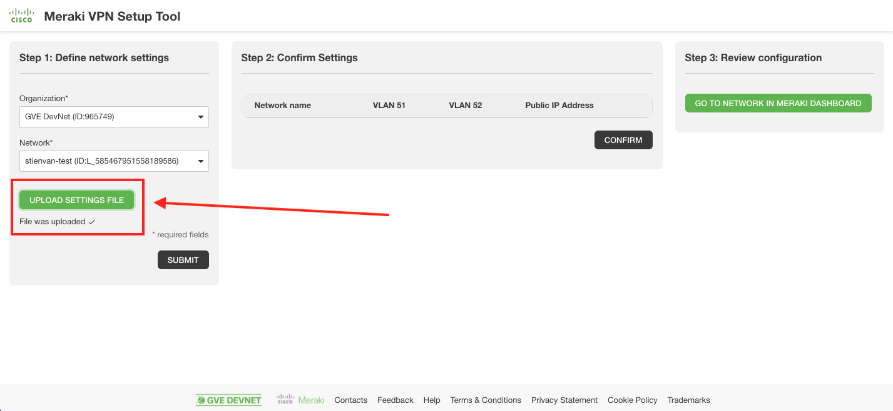

# GVE DevNet Meraki Network VLAN/Firewall/VPN Configuration 
This prototype automates the configuration of a Meraki network's VLAN lay-out, firewall rules, and site-to-site VPN setup based on a user-submitted spreadheet of network settings - bringing network configuration overhead down from hours to seconds.

## High-level Overview

 

## Contacts
* Stien Vanderhallen (stienvan@cisco.com)
* Simon Fang (sifang@cisco.com)

## Solution Components
* Python 3
* Flask
* Meraki Dashboard
* Meraki REST API

## How to obtain a Meraki API Key

In order to use the Cisco Meraki API, you have to enable the API for your organization first. After having enabled API access, you can generate an API key. You can follow the following instructions on how to enable API access and how to generate an API key:

1. Log in to the Cisco Meraki dashboard

2. In the left-hand menu, go to `Organization > Settings > Dasbhoard API access`

3. Click on `Enable access to the Cisco Meraki Dashboard API`

4. Go to `Profile > API access`

5. Under `API access`, click on `Generate API key`

6. Save the API key in a safe place. Please note that the API key will be shown only once for security purposes. In case you lose the key, then you have to revoke the key and regenerate a new key. Moreover, there is a limit of only two API keys per profile. 

> For more information on how to generate an API key, please click here [here](https://documentation.meraki.com/General_Administration/Other_Topics/Cisco_Meraki_Dashboard_API)

> Note: Make sure this API key has write access to both the source and target organization. You can add your account as Full Organization Admin to both organizations by following the instructions [here](https://documentation.meraki.com/General_Administration/Managing_Dashboard_Access/Managing_Dashboard_Administrators_and_Permissions).

## Installation/Configuration

The following commands are executed in the terminal.

1. Create and activate a virtual environment for the project:
   
        #WINDOWS:
        $ py -3 -m venv [add_name_of_virtual_environment_here] 
        $ source [add_name_of_virtual_environment_here]/Scripts/activate
        #MAC:
        $ python3 -m venv [add_name_of_virtual_environment_here] 
        $ source [add_name_of_virtual_environment_here]/bin/activate
        
> For more information about virtual environments, please click [here](https://docs.python.org/3/tutorial/venv.html)

2. Access the created virtual environment folder

        $ cd [add_name_of_virtual_environment_here]

3. Clone this repository

        $ git clone [add_link_to_repository_here]

4. Access the folder `gve_devnet_template_network_removal`

        $ cd gve_devnet_template_network_removal

5. Install the dependencies:

        $ pip install -r requirements.txt

## Setup
1. Now it is time to launch the application! Simply type in the following command in your terminal:

    $ python app.py

2. Now open your favourite browser, and navigate to `localhost:5151`

3. On accessing the application the first time, you will be prompted for your Meraki API Key as obtained following the instructions above. Should you want to change it later on, navigate to `localhost:5151/settings`.

 

## Workflow

1. At `localhost:5151`, find the landing page of the prototype

2. Select the Meraki organization and network you want to configure

3. Upload a CSV file holding your desired network settings (an example is provided in `test.csv`), and click `Submit`

4. Consult the settings as uploaded in step 3

5. Select the settings you want to apply to the network selected in step 2, and augment the settings data with your desired subnet prefixes

6. Select the settings you want to apply to the network selected in step 2, and augment the settings data with your desired subnet prefixes, and click `Confirm`

# Screenshots

### LICENSE

Provided under Cisco Sample Code License, for details see [LICENSE](LICENSE.md)

### CODE_OF_CONDUCT

Our code of conduct is available [here](CODE_OF_CONDUCT.md)

### CONTRIBUTING

See our contributing guidelines [here](CONTRIBUTING.md)

#### DISCLAIMER:
<b>Please note:</b> This script is meant for demo purposes only. All tools/ scripts in this repo are released for use "AS IS" without any warranties of any kind, including, but not limited to their installation, use, or performance. Any use of these scripts and tools is at your own risk. There is no guarantee that they have been through thorough testing in a comparable environment and we are not responsible for any damage or data loss incurred with their use.
